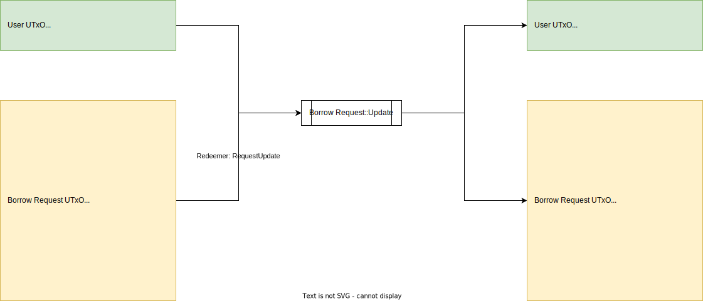

# Borrow Request::Update

## UTxO Diagram



## Explanations

### Inputs

- Borrow Request UTxO: Hold current state of borrow request authenticated by Borrow Request NFT
- Borrower UTxO: Hold ownership token (Borrower NFT) of the borrow request

### Outputs

- Borrow Request UTxO: Hold next state of borrow request authenticated by Borrow Request NFT
- Borrower UTxO: Hold ownership token (Borrower NFT) of the borrow request

### Redeemers

- RequestUpdate

```aiken
RequestUpdate { 
    # policy ID of borrow request NFT
    pid: PolicyId
}
```
