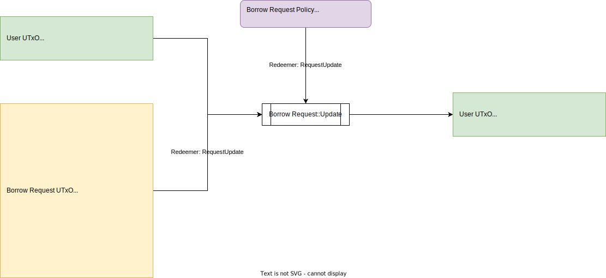

# Borrow Request::Close

## UTxO Diagram



## Explanations

### Inputs

- Borrower UTxO
- Borrow Request UTxO: Hold state of borrow request authenticated by Borrow Request NFT

### Outputs

- Borrower UTxO: Hold ownership token (Borrower NFT) of the borrow request

### Redeemers

- RequestUpdate

```aiken
RequestUpdate { 
    # policy ID of borrow request NFT
    pid: PolicyId
}
```

### Notes

- We don't burn Borrower NFT since the closed borrow request might introduce bonds previously. So borrowers can still use their NFT normally after close their borrow requests
