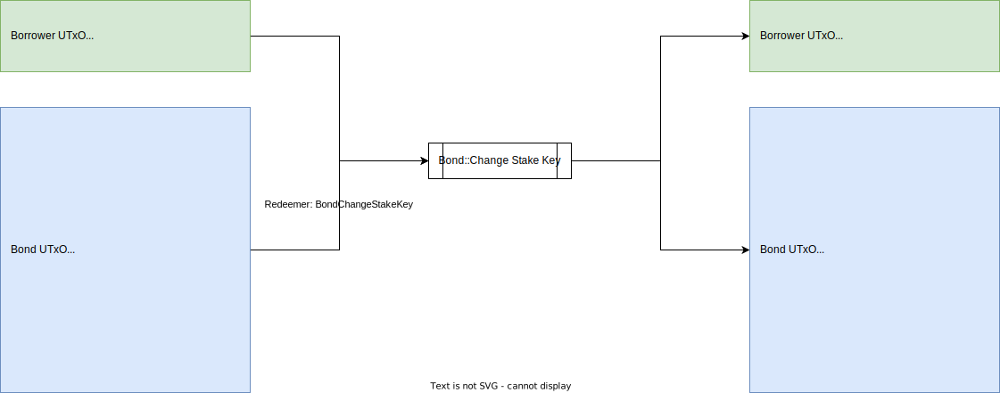

# Bond::Change Stake Key

## UTxO Diagram



## Explanations

### Inputs

- Bond UTxO: Hold state of bond owned by the borrower
- Borrower UTxO: Hold ownership token (Borrower NFT) of the bond

### Outputs

- Bond UTxO: Updated only stake credential
- Borrower UTxO: Hold ownership token (Borrower NFT) of the bond

### Redeemers

- BondChangeStakeKey

```aiken
BondChangeStakeKey { 
  # policy ID of bond NFT
  pid: PolicyId
}
```

### Notes

- Setting stake key to `None` is disallowed
