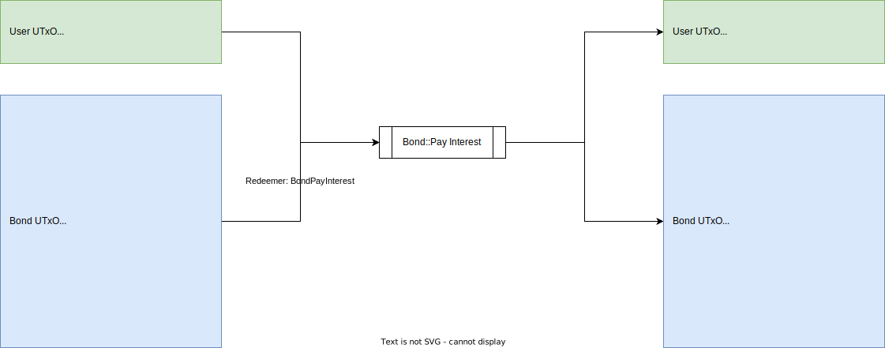

# Bond::Pay Interest

## UTxO Diagram



## Explanations

### Inputs

- Payer UTxO
- Bond UTxO: Hold current state of bond to pay interest

### Outputs

- Payer UTxO
- Bond UTxO: Hold next state of bond after payment

### Redeemers

- BondPayInterest

```aiken
BondPayInterest { 
  # policy ID of bond NFT
  pid: PolicyId
}
```

### Notes

- Payer isn't restricted, meaning that everyone can pay interest for bonds