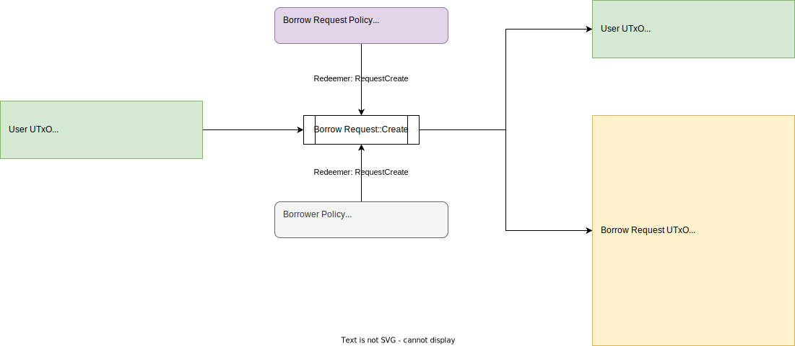

# Table of Contents

- [Table of Contents](#table-of-contents)
- [Overview](#overview)
  - [Smart Contract Interactions](#smart-contract-interactions)
  - [Tokens](#tokens)
  - [UTxOs](#utxos)
    - [Borrow Request UTxO](#borrow-request-utxo)
    - [Bond UTxO](#bond-utxo)
- [Transactions](#transactions)
  - [Borrow Request::Create](#borrow-requestcreate)
    - [UTxO Diagram](#utxo-diagram)
    - [Explanations](#explanations)
      - [Inputs](#inputs)
      - [Outputs](#outputs)
      - [Redeemers](#redeemers)
      - [Notes](#notes)
  - [Borrow Request::Update](#borrow-requestupdate)
    - [UTxO Diagram](#utxo-diagram-1)
    - [Explanations](#explanations-1)
      - [Inputs](#inputs-1)
      - [Outputs](#outputs-1)
      - [Redeemers](#redeemers-1)
  - [Borrow Request::Close](#borrow-requestclose)
    - [UTxO Diagram](#utxo-diagram-2)
    - [Explanations](#explanations-2)
      - [Inputs](#inputs-2)
      - [Outputs](#outputs-2)
      - [Redeemers](#redeemers-2)
      - [Notes](#notes-1)
  - [Bond::Create](#bondcreate)
    - [UTxO Diagram](#utxo-diagram-3)
      - [Fulfilling Borrow Request Entirely](#fulfilling-borrow-request-entirely)
      - [Fulfilling Borrow Request Partially](#fulfilling-borrow-request-partially)
    - [Explanations](#explanations-3)
      - [Inputs](#inputs-3)
      - [Outputs](#outputs-3)
      - [Redeemers](#redeemers-3)
      - [Notes](#notes-2)
  - [Bond::Change Stake Key](#bondchange-stake-key)
    - [UTxO Diagram](#utxo-diagram-4)
    - [Explanations](#explanations-4)
      - [Inputs](#inputs-4)
      - [Outputs](#outputs-4)
      - [Redeemers](#redeemers-4)
      - [Notes](#notes-3)
  - [Bond::Pay Interest](#bondpay-interest)
    - [UTxO Diagram](#utxo-diagram-5)
    - [Explanations](#explanations-5)
      - [Inputs](#inputs-5)
      - [Outputs](#outputs-5)
      - [Redeemers](#redeemers-5)
      - [Notes](#notes-4)
  - [Bond::Bond Redeem](#bondbond-redeem)
    - [UTxO Diagram](#utxo-diagram-6)
      - [Redeem Entirely](#redeem-entirely)
      - [Redeem Partially](#redeem-partially)
    - [Explanations](#explanations-6)
      - [Inputs](#inputs-6)
      - [Outputs](#outputs-6)
      - [Redeemers](#redeemers-6)
      - [Notes](#notes-5)

# Overview

This section introduces a general on-chain flow of Danogo Bond Issue

## Smart Contract Interactions


As the diagram above, users (Borrower/Lender) will interact with two types of entities (**Borrow Request** and **Bond**). Borrower creates borrow requests, and then lenders fulfills the borrow requests. The fulfilling transactions introduce bonds and send bond tokens as certificate to lender to redeem bond later.  

## Tokens

- **Borrower NFT**: Non-fungible token to represent ownership of a borrow request
- **Borrow Request NFT**: Non-fungible token to authenticate a borrow request state
- **Bond NFT**: Non-fungible token to authenticate a bond state
- **Bond Tokens**: Fungible tokens act like certificates to redeem specified bond

## UTxOs

- **Borrow Request UTxO**: reflects the state of a borrow request. Locking prepaid interest
- **Bond UTxO**: reflects the state of a bond. Locking bond principal and interest

### Borrow Request UTxO

| Field                     | Value                      | Note                             |
| ------------------------- | -------------------------- | -------------------------------- |
| Address.StakeCredential   | Borrower Specified         |                                  |
| Address.PaymentCredential | Borrow Request Script Hash |                                  |
| Value[Ada]                | Prepaid Interest           |                                  |
| Value[BorrowRequestNFT]   | 1                          | Unique. Using for authentication |
| Datum                     | BorrowRequestDatum         | State of borrow request          |
| ReferenceScript           | None                       |                                  |

```aiken
type BorrowRequestDatum {
  # borrower interest rate
  apr: Int,
  # borrow duration in epoch
  duration: Int,
  # policy ID of Borrower NFT
  symbol: PolicyId,
  # asset name of Borrower NFT
  borrower: AssetName,
  # desired bond amount to borrow
  requested: Int,
  # bond quantity issued by this request
  issued: Int,
  # lovelace reward per epoch for lender
  epo_rewards: Int,
  # number of epoch borrower paid for interest in advance
  prepaid: Int,
  # number of epochs in advance
  # that the loan must have its interest paid for in order to survive
  buffer: Int,
  # protocol fee
  fee: Int,
}
```

### Bond UTxO

| Field                     | Value                | Note                             |
| ------------------------- | -------------------- | -------------------------------- |
| Address.StakeCredential   | Borrower Specified   |                                  |
| Address.PaymentCredential | Bond Script Hash     |                                  |
| Value[Ada]                | Principal + Interest |                                  |
| Value[BondNFT]            | 1                    | Unique. Using for authentication |
| Datum                     | BondDatum            | State of Bond                    |
| ReferenceScript           | None                 |                                  |

```aiken
type BondDatum {
  # reward per epoch for lender
  epo_rewards: Value,
  # bond duration
  duration: Int,
  # bond policy ID
  bond_symbol: PolicyId,
  # bond name
  token_name: AssetName,
  # bond amount
  bond_amount: Int,
  # number of epochs in advance
  # that the loan must have its interest paid for in order to survive
  buffer: Int,
  # protocol fee
  fee: Int,
  # name of borrower, would be asset name of Borrower NFT that owns the loan
  borrower: AssetName,
  # bond issuance epoch
  start: Int, 
}
```

# Transactions

## Borrow Request::Create

### UTxO Diagram



### Explanations

#### Inputs

- Borrower UTxO

#### Outputs

- Borrow Request UTxO: Hold state of borrow request authenticated by Borrow Request NFT
- Borrower UTxO: Hold ownership token (Borrower NFT) of the borrow request

#### Redeemers

- RequestCreate

```aiken
RequestCreate {
    # output reference of a spending input (in this transaction) to generate nft name
    out_ref: OutputReference,
    # payment script hash of borrow request
    req_skh: ScriptKeyHash,
    # policy id of minting tokens
    pid: PolicyId,
  }
```

#### Notes

- Both of Borrower NFT and Borrow Request NFT are unique on protocol. In order to achieve the uniqueness, a reference of spending input will be specified as seed to generate the nft name. Since the out ref is unique, the generated name is also unique: $$ nft\_name = blake2b\_256(output\_reference)$$

## Borrow Request::Update

### UTxO Diagram


### Explanations

#### Inputs

- Borrow Request UTxO: Hold current state of borrow request authenticated by Borrow Request NFT
- Borrower UTxO: Hold ownership token (Borrower NFT) of the borrow request

#### Outputs

- Borrow Request UTxO: Hold next state of borrow request authenticated by Borrow Request NFT
- Borrower UTxO: Hold ownership token (Borrower NFT) of the borrow request

#### Redeemers

- RequestUpdate

```aiken
RequestUpdate { 
    # policy ID of borrow request NFT
    pid: PolicyId
}
```

## Borrow Request::Close

### UTxO Diagram


### Explanations

#### Inputs

- Borrower UTxO
- Borrow Request UTxO: Hold state of borrow request authenticated by Borrow Request NFT

#### Outputs

- Borrower UTxO: Hold ownership token (Borrower NFT) of the borrow request

#### Redeemers

- RequestUpdate

```aiken
RequestUpdate { 
    # policy ID of borrow request NFT
    pid: PolicyId
}
```

#### Notes

- We don't burn Borrower NFT since the closed borrow request might introduce bonds previously. So borrowers can still use their NFT normally after close their borrow requests

## Bond::Create

### UTxO Diagram

#### Fulfilling Borrow Request Entirely


#### Fulfilling Borrow Request Partially


### Explanations

#### Inputs

- Lender UTxO: to pay transaction fee
- Borrow Request UTxO: Hold state of borrow request authenticated by Borrow Request NFT

#### Outputs

- Lender UTxO: Hold bond tokens
- Bond UTxO: Hold state of bond was created
- [Optional] Borrow Request UTxO: the remain request when fulfilling partially

#### Redeemers

- BondCreate

```aiken
BondCreate {
  # output reference of a spending input (in this transaction) to generate bond nft name
  out_ref: OutputReference,
  # payment script hash of borrow request
  req_skh: ScriptKeyHash,
  # payment script hash of bond
  bond_skh: ScriptKeyHash,
  # policy ID of borrow request
  pid: PolicyId,
}
```

#### Notes

- Borrow Request NFT will be burned when lender fulfills borrow request entirely
- Bond NFT are unique on protocol. In order to achieve the uniqueness, a reference of spending input will be specified as seed to generate the nft name. Since the out ref is unique, the generated name is also unique: $$ nft\_name = blake2b\_256(output\_reference)$$

## Bond::Change Stake Key

### UTxO Diagram


### Explanations

#### Inputs

- Bond UTxO: Hold state of bond owned by the borrower
- Borrower UTxO: Hold ownership token (Borrower NFT) of the bond

#### Outputs

- Bond UTxO: Updated only stake credential
- Borrower UTxO: Hold ownership token (Borrower NFT) of the bond

#### Redeemers

- BondChangeStakeKey

```aiken
BondChangeStakeKey { 
  # policy ID of bond NFT
  pid: PolicyId
}
```

#### Notes

- Setting stake key to `None` is disallowed

## Bond::Pay Interest

### UTxO Diagram


### Explanations

#### Inputs

- Payer UTxO
- Bond UTxO: Hold current state of bond to pay interest

#### Outputs

- Payer UTxO
- Bond UTxO: Hold next state of bond after payment

#### Redeemers

- BondPayInterest

```aiken
BondPayInterest { 
  # policy ID of bond NFT
  pid: PolicyId
}
```

#### Notes

- Payer isn't restricted, meaning that everyone can pay interest for bonds

## Bond::Bond Redeem

### UTxO Diagram

#### Redeem Entirely


#### Redeem Partially


### Explanations

#### Inputs

- Lender UTxO: Hold tokens of bond to redeem
- Bond UTxO: Hold current state of bond

#### Outputs

- Danogo Fee OTxO: Collect protocol fee
- Lender UTxO: Hold tokens of bond to redeem
- Bond UTxO: Hold next state of bond after redeemed

#### Redeemers

- BondRedeem

```aiken
BondRedeem { 
  # policy ID of Bond NFT/Bond Token depending on which validator 
  pid: PolicyId
}
```

#### Notes

- Bond NFT will be burned when redeeming entirely
- Lender pay for lending fee, only when redeeming bonds
