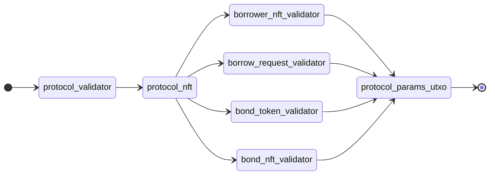

# Description

Deploying Bond Issue smart contract automatically

## Prerequisites

- Requires [Bun](https://bun.sh/) as node engine
- Environment Variables
  - `SEED`: a passphrase for signing automatically
    - **Note**: Do know the risk when using this variable
  - `KOIOS_PROJECT_ID` (optional): a string of Koios's project id. Give empty if using public plan

## Usage

- Using Makefile: `make deploy-bond-issue`
- Or running directly file for debugging: `bun run deploy.ts`

## Deployment Order

## TODOs

- [ ] Integrate with CI/CD
- [ ] Add automation tests against deployed contracts
- [ ] Interactive mode without requiring signing key
- [ ] Deployment chaining: allowing dependent contracts can be chained to deploy in order
